  

  

  
  

## 🧠 About Me

## 🛠️ Tech Stack

**Languages**

**Web Development**

-lightgrey?style=flat-square&logo=react&logoColor=black)

-lightgrey?style=flat-square&logo=node.js&logoColor=black)

**Databases**

**AI & Machine Learning**

**IoT & Hardware**

**Game Development**

**Tools & Technologies**

-FCC624?style=flat-square&logo=linux&logoColor=black)

 

## 📊 GitHub Stats

<picture>
  <source media="(prefers-color-scheme: dark)" srcset="https://raw.githubusercontent.com/Batman1103/Batman1103/main/dark_mode.svg">
  <source media="(prefers-color-scheme: light)" srcset="https://raw.githubusercontent.com/Batman1103/Batman1103/main/light_mode.svg">
  
</picture>

 

